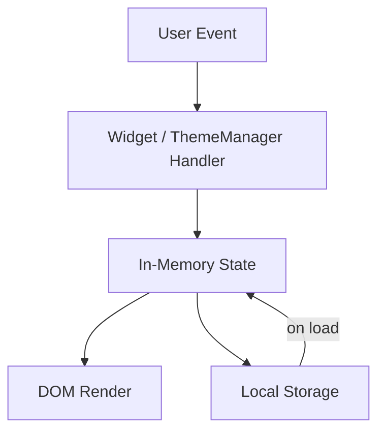

# Design Document: Dashboard Enhancements

## Overview

This document covers three incremental enhancements to the existing Personal Dashboard:

1. **Light / Dark mode** — CSS custom-property theming toggled by a header button, persisted to `localStorage`.
2. **Custom name in greeting** — an inline name input inside the Greeting widget that personalises the greeting message, persisted to `localStorage`.
3. **Sort tasks** — a `<select>` control above the task list that re-orders the rendered list without mutating the underlying data, persisted to `localStorage`.

All changes are confined to the three existing files: `index.html`, `css/style.css`, and `js/app.js`. No new files, no build tools, no frameworks are introduced.

---

## Architecture

The existing architecture is unchanged: a single `DOMContentLoaded` listener bootstraps four widget objects. Each enhancement is a minimal extension of the relevant widget (or a new thin utility for theming).

```
index.html
├── <header>  ← new: contains Theme_Toggle button
├── <link> css/style.css
└── <script> js/app.js
    ├── ThemeManager     ← new: reads/writes dashboard_theme, sets data-theme on <body>
    ├── GreetingWidget   ← extended: reads/writes dashboard_name, renders name in message
    ├── TimerWidget      ← unchanged
    ├── TodoWidget       ← extended: reads/writes dashboard_sort, sorts at render time
    └── LinksWidget      ← unchanged
```

Data flow remains one-directional and unchanged:



---

## Components and Interfaces

### ThemeManager (new)

A small object responsible solely for reading, writing, and applying the active theme. It has no dependency on any widget.

```js
ThemeManager = {
  STORAGE_KEY: 'dashboard_theme',
  VALID_THEMES: ['light', 'dark'],

  load(): 'light' | 'dark'
    // reads localStorage[STORAGE_KEY]
    // returns value if it is a valid theme, otherwise 'light'

  save(theme: 'light' | 'dark'): void
    // writes theme to localStorage[STORAGE_KEY]

  apply(theme: 'light' | 'dark'): void
    // sets document.body.dataset.theme = theme

  toggle(): void
    // flips current theme, calls save() and apply()

  init(): void
    // calls load(), apply(), attaches click listener to toggle button
}
```

### GreetingWidget (extended)

Two new responsibilities added to the existing widget:

1. Read `dashboard_name` from `localStorage` on `init()`.
2. Render the name as part of the greeting message on every `render()` call.
3. Provide a `Name_Input` form that saves the name and re-renders.

```js
GreetingWidget = {
  // existing
  formatTime(date: Date): string
  formatDate(date: Date): string
  getGreeting(hour: number): string

  // extended
  name: string                    // in-memory, loaded from localStorage on init

  loadName(): string              // reads localStorage['dashboard_name'], returns '' if absent
  saveName(name: string): void    // writes trimmed name to localStorage['dashboard_name']

  buildMessage(hour: number, name: string): string
    // pure: returns e.g. "Good morning, Alex" or "Good morning"

  render(): void
    // updated: uses buildMessage(hour, this.name) instead of getGreeting(hour)

  init(): void
    // updated: calls loadName(), attaches Name_Input submit handler, then render()
}
```

### TodoWidget (extended)

Two new responsibilities added to the existing widget:

1. Read `dashboard_sort` from `localStorage` on `init()`.
2. Apply the active sort order at render time via a pure `sortTasks()` helper (never mutates `this.tasks`).
3. Provide a `Sort_Control` `<select>` that saves the sort order and re-renders.

```js
TodoWidget = {
  // existing
  tasks: Task[]
  load(): Task[]
  save(): void
  addTask(text: string): void
  editTask(id: string, text: string): void
  toggleTask(id: string): void
  deleteTask(id: string): void

  // extended
  sortOrder: 'creation' | 'alphabetical' | 'status'  // in-memory

  loadSort(): 'creation' | 'alphabetical' | 'status'
    // reads localStorage['dashboard_sort']
    // returns value if valid, otherwise 'creation'

  saveSort(order: string): void
    // writes order to localStorage['dashboard_sort']

  sortTasks(tasks: Task[], order: string): Task[]
    // pure: returns a new sorted array, never mutates input

  render(): void
    // updated: calls sortTasks(this.tasks, this.sortOrder) to get display order
    //          renders the sorted copy, not this.tasks directly

  init(): void
    // updated: calls loadSort(), attaches Sort_Control change handler, then existing init
}
```

---

## Data Models

### Task (updated)

```js
{
  id: string,          // crypto.randomUUID()
  text: string,        // non-empty, trimmed
  completed: boolean,  // false on creation
  createdAt: number    // Date.now() at moment of creation — NEW
}
```

Stored in `localStorage` under key `"dashboard_tasks"` as a JSON array. The `createdAt` field is added to all new tasks; existing tasks without it fall back to `0` for sort purposes (they sort before any timestamped task).

### Theme (new, in-memory + localStorage)

```
localStorage key: "dashboard_theme"
valid values:     "light" | "dark"
default:          "light"
```

Applied as `document.body.dataset.theme` (`data-theme="light"` or `data-theme="dark"`).

### User Name (new, in-memory + localStorage)

```
localStorage key: "dashboard_name"
valid values:     any non-empty trimmed string
default:          "" (empty — no name shown)
```

### Sort Order (new, in-memory + localStorage)

```
localStorage key:  "dashboard_sort"
valid values:      "creation" | "alphabetical" | "status"
default:           "creation"
```

---

## HTML Changes

A `<header>` element is added above `<main>` to hold the theme toggle. The Greeting widget gains a name form. The Todo widget gains a sort control.

```html
<!-- New header with theme toggle -->
<header class="dashboard-header">
  <button class="theme-toggle" aria-label="Toggle light/dark mode">🌙</button>
</header>

<!-- Greeting widget — name form added -->
<section id="greeting" class="widget">
  <h2 class="greeting-time"></h2>
  <p class="greeting-date"></p>
  <p class="greeting-message"></p>
  <form class="name-form">
    <input type="text" class="name-input" placeholder="Enter your name…" />
    <button type="submit">Save</button>
  </form>
</section>

<!-- Todo widget — sort control added above the list -->
<section id="todo" class="widget">
  <h2>To-Do</h2>
  <form class="todo-form">
    <input type="text" class="todo-input" placeholder="Add a task…" />
    <button type="submit">Add</button>
  </form>
  <select class="todo-sort">
    <option value="creation">Creation order</option>
    <option value="alphabetical">Alphabetical</option>
    <option value="status">Status</option>
  </select>
  <ul class="todo-list"></ul>
</section>
```

---

## CSS Changes

### Theming via CSS custom properties

All color values are expressed as CSS custom properties on `:root` (light theme defaults) and overridden under `[data-theme="dark"]` on `body`.

```css
:root {
  --color-bg:      #f0f2f5;
  --color-surface: #ffffff;
  --color-text:    #1a1a2e;
  --color-muted:   #888;
  --color-border:  #ccc;
  --color-accent:  #4f6ef7;
  --color-accent-hover: #3a57d4;
  --color-disabled: #b0b8d4;
}

[data-theme="dark"] {
  --color-bg:      #1a1a2e;
  --color-surface: #16213e;
  --color-text:    #e0e0e0;
  --color-muted:   #888;
  --color-border:  #444;
  --color-accent:  #4f6ef7;
  --color-accent-hover: #6b85f8;
  --color-disabled: #3a3a5c;
}
```

All existing hard-coded color values in `style.css` are replaced with their corresponding variable references (e.g. `background: var(--color-bg)`). No new selectors are needed beyond the variable declarations and the `[data-theme="dark"]` block.

### Header styles

```css
.dashboard-header {
  display: flex;
  justify-content: flex-end;
  padding: 0.75rem 1.5rem;
  background: var(--color-surface);
  border-bottom: 1px solid var(--color-border);
}

.theme-toggle {
  background: transparent;
  border: 1px solid var(--color-border);
  color: var(--color-text);
  border-radius: 6px;
  cursor: pointer;
  font-size: 1.1rem;
  padding: 0.25rem 0.5rem;
}
```

### Sort control styles

```css
.todo-sort {
  margin-top: 0.5rem;
  padding: 0.25rem 0.5rem;
  border: 1px solid var(--color-border);
  border-radius: 6px;
  background: var(--color-surface);
  color: var(--color-text);
  font-size: max(14px, 0.875rem);
  width: 100%;
}
```

---

## Correctness Properties

*A property is a characteristic or behavior that should hold true across all valid executions of a system — essentially, a formal statement about what the system should do. Properties serve as the bridge between human-readable specifications and machine-verifiable correctness guarantees.*

### Property 1: Theme toggle is an involution

*For any* starting theme value (`"light"` or `"dark"`), calling `ThemeManager.toggle()` twice SHALL return the active theme to its original value.

**Validates: Requirements 1.2**

### Property 2: Invalid theme falls back to light

*For any* string that is not `"light"` or `"dark"` stored under `"dashboard_theme"` in `localStorage`, calling `ThemeManager.load()` SHALL return `"light"`.

**Validates: Requirements 1.8**

### Property 3: Theme persistence round-trip

*For any* valid theme value, writing it to `localStorage` via `ThemeManager.save()` and then reading it back via `ThemeManager.load()` SHALL return the same value.

**Validates: Requirements 1.5, 1.6**

### Property 4: Non-empty name appears in greeting

*For any* non-empty, non-whitespace-only string used as a name, `GreetingWidget.buildMessage(hour, name.trim())` SHALL return a string that contains the trimmed name.

**Validates: Requirements 2.2**

### Property 5: Whitespace-only name produces nameless greeting

*For any* string composed entirely of whitespace characters (including the empty string), `GreetingWidget.buildMessage(hour, name.trim())` SHALL return a string that does not contain a comma or any name suffix.

**Validates: Requirements 2.3**

### Property 6: Name persistence round-trip

*For any* non-empty trimmed name string, calling `GreetingWidget.saveName(name)` and then `GreetingWidget.loadName()` SHALL return the same trimmed string.

**Validates: Requirements 2.4, 2.5**

### Property 7: Sort does not mutate the tasks array

*For any* array of Task objects and any sort order value, calling `TodoWidget.sortTasks(tasks, order)` SHALL return a new array and leave the original array reference and its elements unchanged.

**Validates: Requirements 3.2**

### Property 8: Creation sort preserves insertion order

*For any* array of Task objects with distinct `createdAt` timestamps, `TodoWidget.sortTasks(tasks, 'creation')` SHALL return tasks ordered by ascending `createdAt` value.

**Validates: Requirements 3.3, 3.10**

### Property 9: Alphabetical sort is case-insensitive ascending

*For any* array of Task objects, `TodoWidget.sortTasks(tasks, 'alphabetical')` SHALL return tasks such that for every adjacent pair, `taskA.text.toLowerCase() <= taskB.text.toLowerCase()`.

**Validates: Requirements 3.4**

### Property 10: Status sort places incomplete tasks first

*For any* array of Task objects containing at least one incomplete and one complete task, `TodoWidget.sortTasks(tasks, 'status')` SHALL return a list where no completed task appears at an index lower than any incomplete task.

**Validates: Requirements 3.5**

### Property 11: Sort persistence round-trip

*For any* valid sort order value, calling `TodoWidget.saveSort(order)` and then `TodoWidget.loadSort()` SHALL return the same value.

**Validates: Requirements 3.6, 3.7**

### Property 12: New tasks have a numeric createdAt timestamp

*For any* non-empty text string passed to `TodoWidget.addTask(text)`, the resulting Task object SHALL have a `createdAt` field that is a finite positive number.

**Validates: Requirements 3.10**

---

## Error Handling

| Scenario | Handling |
|---|---|
| `localStorage` unavailable (private mode, quota exceeded) | All `setItem` calls are wrapped in try/catch; app works in-session without persistence (unchanged from base) |
| Theme value in `localStorage` is not `"light"` or `"dark"` | `ThemeManager.load()` returns `"light"` as default |
| Name value absent from `localStorage` | `GreetingWidget.loadName()` returns `""`, greeting renders without a name |
| Sort value in `localStorage` is not a valid option | `TodoWidget.loadSort()` returns `"creation"` as default |
| Tasks loaded from `localStorage` lack `createdAt` field | `sortTasks` treats missing `createdAt` as `0`, sorting them before timestamped tasks |
| JSON parse failure on task load | Existing catch block returns `[]` (unchanged) |

---
