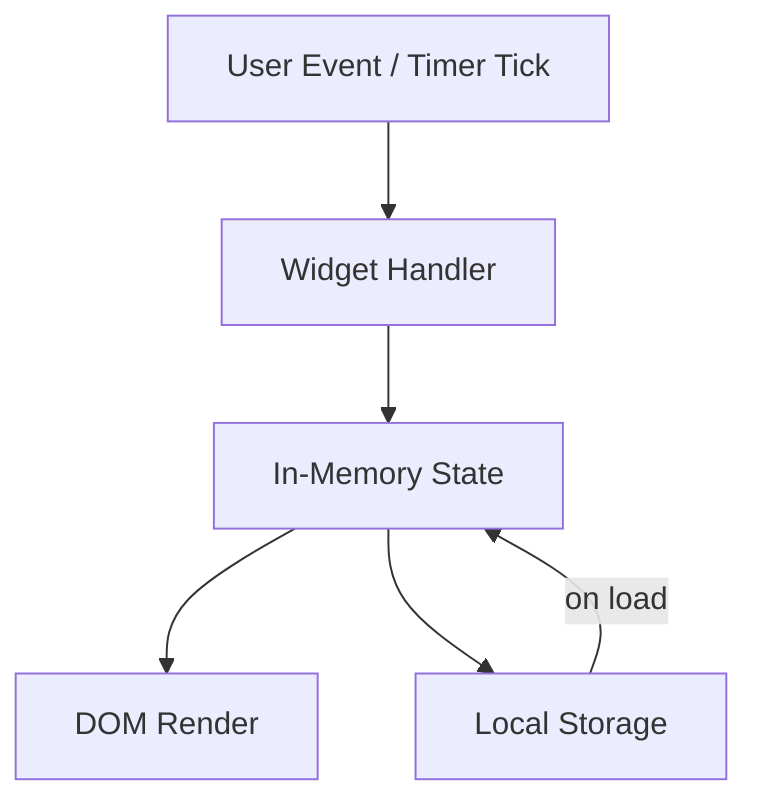

# Design Document: Personal Dashboard

## Overview

A single-page personal dashboard built with HTML, CSS, and Vanilla JavaScript. No build tools, no frameworks, no backend. All state lives in the browser via Local Storage. The app is structured as a single `index.html` entry point, one stylesheet (`css/style.css`), and one script (`js/app.js`).

The four widgets — Greeting, Focus Timer, To-Do List, and Quick Links — are self-contained logical modules within `app.js`, each responsible for its own DOM manipulation, event handling, and (where applicable) Local Storage I/O.

---

## Architecture

The app follows a simple module pattern inside a single IIFE or top-level `DOMContentLoaded` listener. There is no routing, no virtual DOM, and no state management library. Each widget is an object or set of functions that operate on a dedicated section of the DOM.

```
index.html
├── <link> css/style.css
└── <script> js/app.js
    ├── GreetingWidget   — clock/date display, setInterval tick
    ├── TimerWidget      — countdown state machine, setInterval tick
    ├── TodoWidget       — task CRUD, Local Storage read/write
    └── LinksWidget      — link CRUD, Local Storage read/write
```

Data flow is one-directional: user events → widget handler → update in-memory state → re-render DOM → persist to Local Storage (where applicable).



---

## Components and Interfaces

### GreetingWidget

Responsible for displaying the current time, date, and contextual greeting. Starts a `setInterval` that fires every 60 seconds to refresh the display.

```js
GreetingWidget = {
  init()        // attach to DOM, start interval
  render()      // update time, date, greeting text
  getGreeting(hour: number): string  // pure: maps hour → greeting string
  formatTime(date: Date): string     // pure: returns "HH:MM"
  formatDate(date: Date): string     // pure: returns "Weekday, Month Day"
}
```

### TimerWidget

Manages a countdown state machine with three states: `idle`, `running`, `paused`.

```js
TimerWidget = {
  state: { remaining: number, status: 'idle'|'running'|'paused' }
  init()        // attach controls, render initial state
  start()       // transition to running, begin setInterval
  stop()        // transition to paused, clear interval
  reset()       // transition to idle, restore 25:00
  tick()        // decrement remaining, check for completion
  render()      // update MM:SS display, toggle button disabled states
  formatTime(seconds: number): string  // pure: seconds → "MM:SS"
}
```

### TodoWidget

Manages an array of Task objects. All mutations persist to Local Storage.

```js
// Task shape
{ id: string, text: string, completed: boolean }

TodoWidget = {
  tasks: Task[]
  init()                        // load from storage, render
  addTask(text: string)         // validate, push, save, render
  editTask(id: string, text: string)  // validate, update, save, render
  toggleTask(id: string)        // flip completed, save, render
  deleteTask(id: string)        // filter out, save, render
  save()                        // JSON.stringify → localStorage
  load(): Task[]                // JSON.parse ← localStorage, fallback []
  render()                      // rebuild task list DOM
}
```

### LinksWidget

Manages an array of Link objects. All mutations persist to Local Storage.

```js
// Link shape
{ id: string, label: string, url: string }

LinksWidget = {
  links: Link[]
  init()                              // load from storage, render
  addLink(label: string, url: string) // validate, push, save, render
  deleteLink(id: string)              // filter out, save, render
  save()                              // JSON.stringify → localStorage
  load(): Link[]                      // JSON.parse ← localStorage, fallback []
  render()                            // rebuild links DOM
}
```

---

## Data Models

### Task

```js
{
  id: string,        // crypto.randomUUID() or Date.now().toString()
  text: string,      // non-empty, trimmed
  completed: boolean // false on creation
}
```

Stored in Local Storage under key `"dashboard_tasks"` as a JSON array.

### Link

```js
{
  id: string,   // crypto.randomUUID() or Date.now().toString()
  label: string, // non-empty display name
  url: string    // non-empty URL string
}
```

Stored in Local Storage under key `"dashboard_links"` as a JSON array.

### Timer State (in-memory only, not persisted)

```js
{
  remaining: number,  // seconds remaining, starts at 1500 (25 * 60)
  status: 'idle' | 'running' | 'paused'
}
```

---

## Correctness Properties

*A property is a characteristic or behavior that should hold true across all valid executions of a system — essentially, a formal statement about what the system should do. Properties serve as the bridge between human-readable specifications and machine-verifiable correctness guarantees.*

### Property 1: Greeting message covers all hours

*For any* integer hour value in [0, 23], `getGreeting(hour)` SHALL return exactly one of "Good morning", "Good afternoon", "Good evening", or "Good night", with no hour left unclassified.

**Validates: Requirements 1.4, 1.5, 1.6, 1.7**

### Property 2: Timer format is always MM:SS

*For any* integer number of seconds in [0, 1500], `TimerWidget.formatTime(seconds)` SHALL return a string matching the pattern `MM:SS` where MM and SS are zero-padded two-digit numbers.

**Validates: Requirements 2.3**

### Property 3: Timer never goes below zero

*For any* sequence of `tick()` calls on a running timer, the `remaining` value SHALL never become negative.

**Validates: Requirements 2.6**

### Property 4: Adding a valid task grows the list by one

*For any* task list and any non-empty, non-whitespace-only string, calling `addTask` SHALL increase the task list length by exactly one and the new task SHALL contain the trimmed input text.

**Validates: Requirements 3.1**

### Property 5: Whitespace-only input is rejected

*For any* string composed entirely of whitespace characters, calling `addTask` SHALL leave the task list unchanged.

**Validates: Requirements 3.2**

### Property 6: Task persistence round-trip

*For any* array of Task objects, serializing with `save()` then deserializing with `load()` SHALL produce an array that is deeply equal to the original.

**Validates: Requirements 3.8, 3.9, 5.1**

### Property 7: Link persistence round-trip

*For any* array of Link objects, serializing with `save()` then deserializing with `load()` SHALL produce an array that is deeply equal to the original.

**Validates: Requirements 4.5, 4.6, 5.2**

### Property 8: Corrupt storage falls back to empty list

*For any* string that is not valid JSON stored under the tasks or links key, calling `load()` SHALL return an empty array without throwing.

**Validates: Requirements 5.5, 5.6**

### Property 9: Edit with empty text discards change

*For any* task with existing text T, calling `editTask` with an empty or whitespace-only string SHALL leave the task's text equal to T.

**Validates: Requirements 3.5**

### Property 10: Toggle is an involution

*For any* task, calling `toggleTask` twice SHALL return the task to its original `completed` state.

**Validates: Requirements 3.6**

---

## Error Handling

| Scenario | Handling |
|---|---|
| Local Storage unavailable (private mode, quota exceeded) | Wrap `localStorage.setItem` in try/catch; silently degrade — app works in-session without persistence |
| JSON parse failure on load | Catch `JSON.parse` error, return `[]` |
| Invalid URL in Quick Links | Rely on HTML `<input type="url">` validation; do not add if URL is empty |
| Timer already running when start is clicked | Start button is disabled while running (Requirement 2.7), so double-start is not possible |
| Edit confirmed with empty text | Discard edit, restore original text (Requirement 3.5) |
